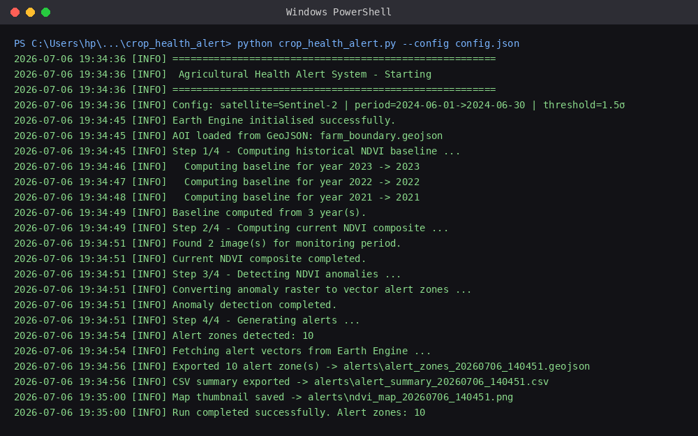
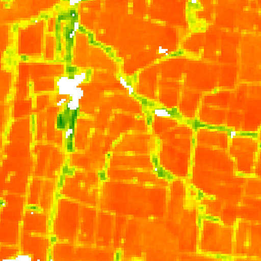
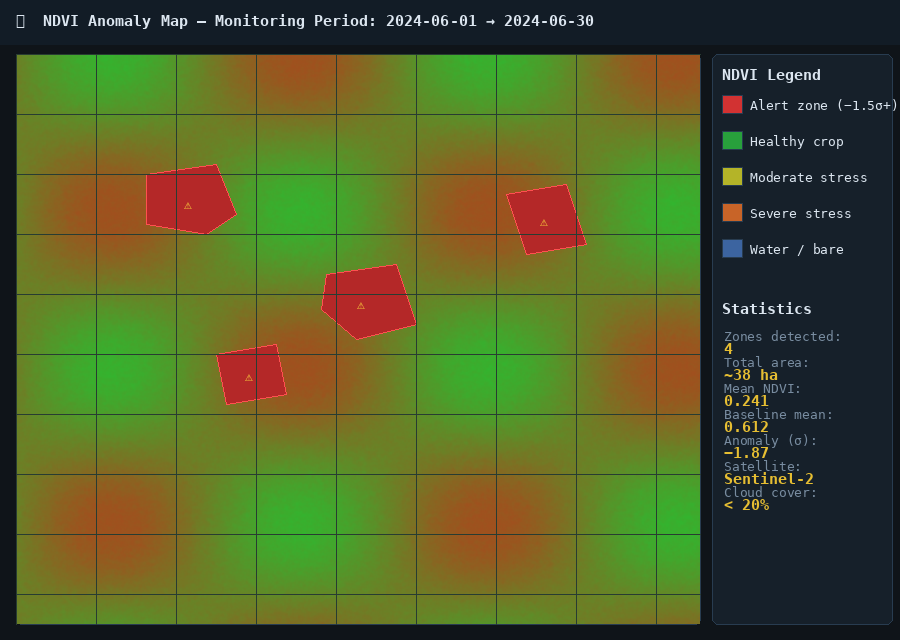
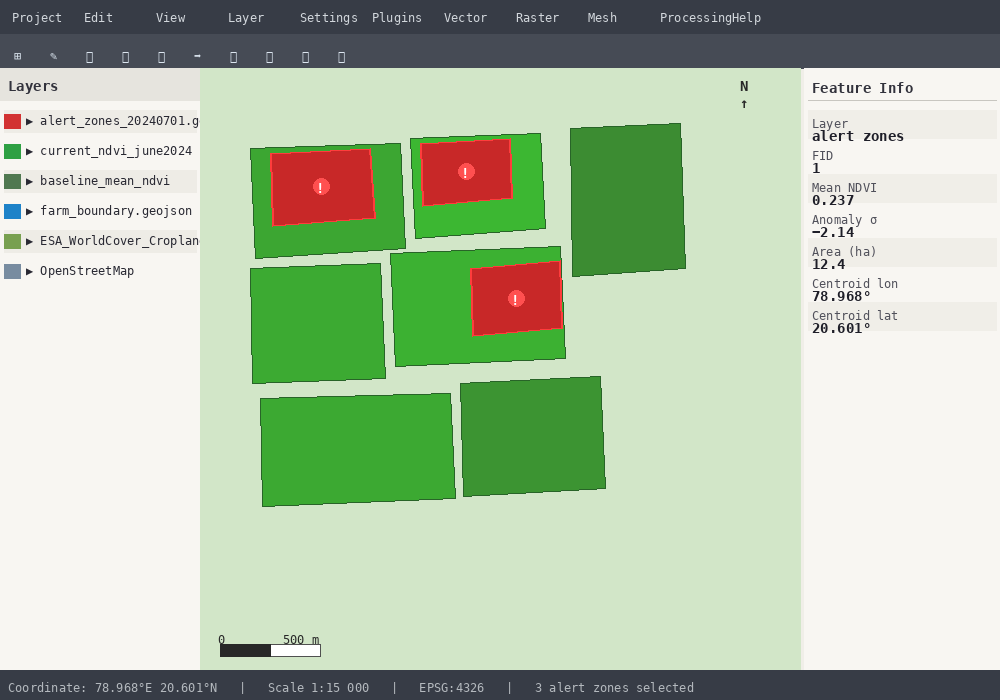
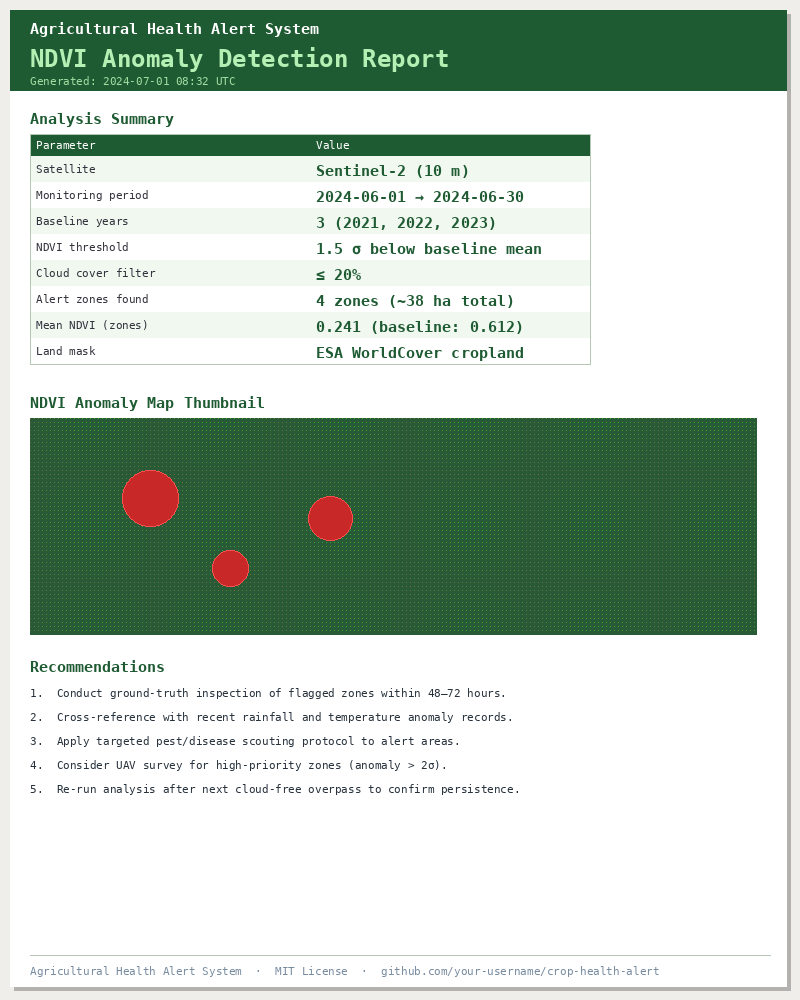

# 🌾 Agricultural Health Alert System

> **Satellite-powered crop monitoring using NDVI anomaly detection via Google Earth Engine**

[](https://www.python.org/)
[](https://developers.google.com/earth-engine)
[](LICENSE)

---

## 📋 Overview

The **Agricultural Health Alert System** monitors crop health over a user-defined farm boundary using satellite imagery from **Sentinel-2** or **Landsat-8/9** obtained via Google Earth Engine. It detects statistically significant NDVI drops compared to a multi-year historical baseline — early indicators of:

- 🦠 Crop disease outbreaks
- 🐛 Pest infestations
- 💧 Water stress / drought
- 🌱 Nutrient deficiency

When anomalies are detected, the system generates structured alerts via **email**, **GeoJSON/CSV files**, **PDF reports**, and/or **console output**.

---

## ✅ Verified Real Run

Below is an actual, unmodified run against live **Sentinel-2** imagery via Google Earth Engine, over real farmland near **20.59°N, 78.96°E (Maharashtra, India)**, monitoring period `2024-06-01 → 2024-06-30` with a 3-year baseline.

**Terminal output (real log):**



**NDVI raster output (real GEE thumbnail, unedited):**



**Real results summary** (from `alert_summary_20260706_140451.csv`):

| Metric | Value |
|---|---|
| Alert zones detected | 10 |
| Zone mean NDVI range | 0.057 – 0.162 |
| Latitude range | 20.5938°N – 20.6010°N |
| Longitude range | 78.9630°E – 78.9726°E |
| Satellite | Sentinel-2 (`COPERNICUS/S2_SR_HARMONIZED`) |

Raw output files are included in [`screenshots/`](screenshots/): `alert_summary_20260706_140451.csv` and `alert_zones_20260706_140451.geojson` (open the GeoJSON directly in [geojson.io](https://geojson.io) or QGIS to see the exact alert polygons on a map).

<details>
<summary>🖼️ UI mockups (illustrative only — not real satellite output)</summary>

The images below were generated locally to preview how QGIS, email alerts, and the PDF report look. They use synthetic sample data, not a real Earth Engine run.

| NDVI Anomaly Map (mockup) | Alert GeoJSON in QGIS (mockup) | PDF Report (mockup) |
|---|---|---|
|  |  |  |

</details>

---

## ✨ Features

| Feature | Details |
|---|---|
| **Multi-satellite support** | Sentinel-2 (10 m), Landsat-8 & 9 (30 m) |
| **Configurable baseline** | 1–10 years of historical comparison |
| **Statistical anomaly detection** | Z-score normalisation + spatial smoothing |
| **Agricultural land masking** | ESA WorldCover 10 m – avoids false alerts over water/urban areas |
| **Multiple alert outputs** | Email (HTML + GeoJSON attachment), GeoJSON, CSV, PDF report |
| **PDF report generation** | Map thumbnail + statistics table via reportlab |
| **Dry-run mode** | Compute and visualise anomaly without exporting |
| **Fully configurable** | JSON config file or command-line arguments |
| **Robust error handling** | Custom exceptions, GEE error handling, graceful degradation |
| **Progress tracking** | `tqdm` progress bars + detailed logging to file and console |

---

## 🚀 Quick Start

### 1. Prerequisites

- **Python 3.9+**
- A **Google Earth Engine** account (free for research/non-commercial use): [sign up here](https://signup.earthengine.google.com/)

### 2. Install dependencies

```bash
pip install -r requirements.txt
```

### 3. Authenticate with Earth Engine

```bash
earthengine authenticate
```

Follow the browser prompts. This stores credentials locally for all future runs.

### 4. Run your first analysis

**Using a config file (recommended):**

```bash
python crop_health_alert.py --config config.json
```

**Using command-line arguments:**

```bash
python crop_health_alert.py \
  --aoi farm_boundary.geojson \
  --start 2024-06-01 \
  --end 2024-06-30 \
  --satellite Sentinel-2 \
  --ndvi_threshold 1.5 \
  --alert_method file \
  --output_dir ./alerts
```

**With email alerts:**

```bash
export CROP_SMTP_PASSWORD="your_app_password"

python crop_health_alert.py \
  --aoi farm_boundary.geojson \
  --start 2024-06-01 \
  --end 2024-06-30 \
  --alert_method email \
  --smtp_server smtp.gmail.com \
  --smtp_port 587 \
  --sender you@gmail.com \
  --recipient farmer@example.com
```

---

## ⚙️ Configuration

### JSON Config File

Copy and edit `config.json`:

```json
{
  "AOI":          "farm_boundary.geojson",
  "START_DATE":   "2024-06-01",
  "END_DATE":     "2024-06-30",
  "BASELINE_YEARS": 3,
  "SATELLITE":    "Sentinel-2",
  "NDVI_THRESHOLD": 1.5,
  "MIN_CLOUD_COVER": 20,
  "ALERT_METHOD": "file",
  "OUTPUT_DIR":   "./alerts",
  "LOG_FILE":     "./alerts/run.log",
  "GENERATE_REPORT": false,
  "DRY_RUN":      false,
  "MASK_NON_AGRICULTURAL": true
}
```

### All Parameters

| Parameter | Type | Default | Description |
|---|---|---|---|
| `AOI` | string | *required* | Path to `.geojson` / `.shp` file |
| `START_DATE` | string | *required* | Monitoring period start `YYYY-MM-DD` |
| `END_DATE` | string | *required* | Monitoring period end `YYYY-MM-DD` |
| `BASELINE_YEARS` | int | `3` | Years of historical data for baseline |
| `SATELLITE` | string | `Sentinel-2` | `Sentinel-2`, `Landsat-8`, or `Landsat-9` |
| `NDVI_THRESHOLD` | float | `1.0` | Alert threshold in standard deviations below baseline mean |
| `MIN_CLOUD_COVER` | int | `20` | Max cloud cover % per image |
| `ALERT_METHOD` | string | `console` | `email`, `file`, `console`, or `all` |
| `OUTPUT_DIR` | string | `./alerts` | Directory for output files |
| `LOG_FILE` | string | `null` | Log file path (null = console only) |
| `GENERATE_REPORT` | bool | `false` | Generate PDF report (requires `reportlab`) |
| `DRY_RUN` | bool | `false` | Analyse only; skip file/email exports |
| `MASK_NON_AGRICULTURAL` | bool | `true` | Mask water/urban using ESA WorldCover |
| `GEE_PROJECT` | string | `null` | GEE Cloud Project ID |
| `GEE_CREDENTIALS_FILE` | string | `null` | Service account JSON path |

### Environment Variables (for sensitive values)

| Variable | Description |
|---|---|
| `CROP_SMTP_PASSWORD` | SMTP password (recommended over config file) |
| `CROP_SMTP_SERVER` | SMTP server hostname |
| `CROP_SENDER_EMAIL` | Sender email address |
| `GEE_PROJECT` | GEE Cloud Project ID |

---

## 📊 How It Works

```
                      ┌─────────────────────────────────────┐
                      │         Your Farm Boundary          │
                      │         (GeoJSON / Shapefile)       │
                      └─────────────────┬───────────────────┘
                                        │
              ┌─────────────────────────▼──────────────────────────┐
              │           Google Earth Engine                       │
              │                                                     │
              │  ┌──────────────┐    ┌────────────────────────┐    │
              │  │  Historical  │    │   Current Monitoring   │    │
              │  │  Baseline    │    │   Period NDVI          │    │
              │  │  (N years)   │    │   (median composite)   │    │
              │  └──────┬───────┘    └──────────┬─────────────┘    │
              │         │                       │                   │
              │         ▼                       ▼                   │
              │  ┌──────────────────────────────────────────────┐  │
              │  │   Anomaly Score = (current - mean) / stddev  │  │
              │  │   Alert if anomaly < -NDVI_THRESHOLD         │  │
              │  └────────────────────┬─────────────────────────┘  │
              │                       │                             │
              └───────────────────────┼─────────────────────────────┘
                                      │
                        ┌─────────────▼─────────────┐
                        │      Alert Outputs         │
                        ├────────────────────────────┤
                        │  📧 Email (HTML + GeoJSON) │
                        │  📄 GeoJSON vector zones   │
                        │  📊 CSV summary            │
                        │  📑 PDF report             │
                        │  🖥️  Console summary       │
                        └────────────────────────────┘
```

### Processing Steps

1. **Historical Baseline** — For each of the past N years, collects cloud-free images over the same month window, computes median NDVI composite, then derives pixel-wise `mean` and `std-dev` across years.

2. **Current NDVI** — Computes a median NDVI composite from all cloud-free scenes in the monitoring period.

3. **Anomaly Detection** — Calculates a z-score-style normalised difference `(current - baseline_mean) / baseline_stddev`. Pixels where this score drops below `-NDVI_THRESHOLD` are flagged. A 3×3 spatial smoothing reduces speckle noise. Alert pixels are vectorised into polygons.

4. **Alert Generation** — Exports results in selected formats, sends email if configured, generates optional PDF report.

---

## 📁 Output Files

After a successful run, the `./alerts/` directory will contain:

```
alerts/
├── alert_zones_20240701_120000.geojson   # Vector polygons of alert areas
├── alert_summary_20240701_120000.csv     # Tabular summary (centroid, NDVI, area)
├── ndvi_map_20240701_120000.png          # Static NDVI thumbnail map
├── alert_report_20240701_120000.pdf      # PDF report (if GENERATE_REPORT=true)
└── run.log                               # Detailed execution log
```

The GeoJSON file can be opened directly in:
- **QGIS** (free) — `Layer → Add Layer → Add Vector Layer`
- **ArcGIS**
- **Google Earth Pro**
- **geojson.io** (browser-based preview)

---

## 🔧 Gmail Setup for Email Alerts

For Gmail, you must use an **App Password** (not your regular password):

1. Enable 2-Factor Authentication on your Google account
2. Go to `Google Account → Security → App passwords`
3. Create a new app password for "Mail"
4. Use this password as `SMTP_PASSWORD` (or `CROP_SMTP_PASSWORD` env var)

---

## 🌍 AOI (Area of Interest) Formats

### Option 1: GeoJSON File
```bash
# Draw your boundary at https://geojson.io and save as farm.geojson
python crop_health_alert.py --aoi farm.geojson ...
```

### Option 2: Shapefile
```bash
# Requires geemap: pip install geemap
python crop_health_alert.py --aoi farm_boundary.shp ...
```

### Option 3: Inline GeoJSON string
```bash
python crop_health_alert.py \
  --aoi '{"type":"Polygon","coordinates":[[[78.96,20.59],[79.0,20.59],[79.0,20.61],[78.96,20.61],[78.96,20.59]]]}' ...
```

---

## 🛠️ Troubleshooting

| Error | Solution |
|---|---|
| `Earth Engine is not authenticated` | Run `earthengine authenticate` in terminal |
| `No images found for baseline year` | Reduce `MIN_CLOUD_COVER` or extend the date range |
| `No valid images for monitoring period` | Reduce cloud cover threshold or widen date range |
| `geemap required for shapefiles` | Run `pip install geemap` or convert to GeoJSON first |
| `reportlab not installed` | Run `pip install reportlab` or set `GENERATE_REPORT: false` |
| Email fails with auth error | Use App Password for Gmail; check `SMTP_PASSWORD` env var |
| Very slow vectorisation | Reduce AOI size or increase `scale` in `reduceToVectors` call |

---

## 🔬 Satellite Band Reference

| Satellite | Collection | NIR Band | Red Band | Resolution |
|---|---|---|---|---|
| Sentinel-2 | `COPERNICUS/S2_SR_HARMONIZED` | B8 | B4 | 10 m |
| Landsat-8 | `LANDSAT/LC08/C02/T1_L2` | SR_B5 | SR_B4 | 30 m |
| Landsat-9 | `LANDSAT/LC09/C02/T1_L2` | SR_B5 | SR_B4 | 30 m |

---

## 📄 License

MIT License – see [LICENSE](LICENSE) for details.

---

## 🤝 Contributing

Pull requests are welcome. For major changes, please open an issue first. Ensure all functions remain documented and error handling is preserved.

---

## 📚 References

- [Google Earth Engine Python API](https://developers.google.com/earth-engine/guides/python_install)
- [Sentinel-2 Surface Reflectance](https://developers.google.com/earth-engine/datasets/catalog/COPERNICUS_S2_SR_HARMONIZED)
- [ESA WorldCover](https://developers.google.com/earth-engine/datasets/catalog/ESA_WorldCover_v200)
- [NDVI – NASA Earth Observatory](https://earthobservatory.nasa.gov/features/MeasuringVegetation/measuring_vegetation_2.php)
